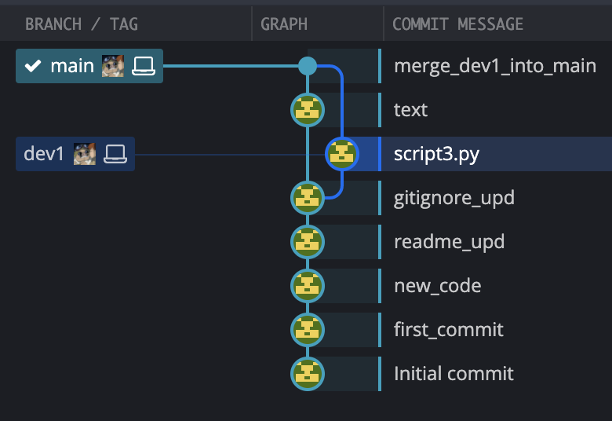

### Зайцев Н.В. ПИ20-2в  
### Практика 1-3: Работа с Git в терминале
***
#### Обзор веток и коммитов:  

#### Команды:
```bash
774  cd git/Pract1-3_Unix/ls
775  cd git/Pract1-3_Unix/
776  ls
777  touch scritpt.py
778  mv scritpt.py script.py
779  ls
780  echo "print(123)" > script.py
781  cat script.py
782  git add script.py
783  git status
784  git commit
785  git commit -m first commit
786  git commit -m first_commit
787  git commit push
788  git push
789  cat ~/.ssh/id_rsa.pub
790  ssh-keygen -t rsa -b 4096 -C "nikitos945max@gmail.com"
791  cat ~/.ssh/id_rsa.pub
792  git push
793  touch script2.py
794  nano script
795  nano script2.py
796  python3 script2.py
797  git add script2.py
798  nano script.py
799  git status
800  git add script.py
801  git commit -m new_code
802  git push
803  ls
804  history
805  git add README.md
806  git commit -m readme_upd
807  git push
808  git pull
809  git log
810  python3 -m venv venv
811  touch .gitignore
812  echo "*.docx" > .gitignore
813  cat .gitignore
814  source venv/bin/activate
815  pip install aiohttp
816  pip freeze -r requirements.txt
817  touch requirements.txt
818  pip freeze -r requirements.txt
819  pip freeze -r > requirements.txt
820  cat requirements.txt
821  pip freeze -r requirements.txt
822  pip freeze > requirements.txt
823  cat requirements.txt
824  git add requirements.txt
825  echo "venv" > .gitignore
826  ls
827  cat .gitignore
828  nano .gitignore
829  git add .gitignore
830  git commit -m gitignore_upd
831  git push
832  git checkout -b dev1
833  touch script3.py
834  echo "print('dev brach')"
835  echo "print('dev brach')" > script3.py
836  git add script3.py
837  git commit -m script3.py
838  git push
839  git push --set-upstream origin dev1
840  git checkout -b main
841  git checkout main
842  ld
843  ls
844  touch text.txt
845  echo some description
846  echo some description > text.txt
847  git add text.txt
848  git commit -m text
849  git push
850  git merge
851  git merge dev1
852  git merge -m megre dev1
853  ls
854  git commit -m merge_dev1_into_main
855  git push
```
